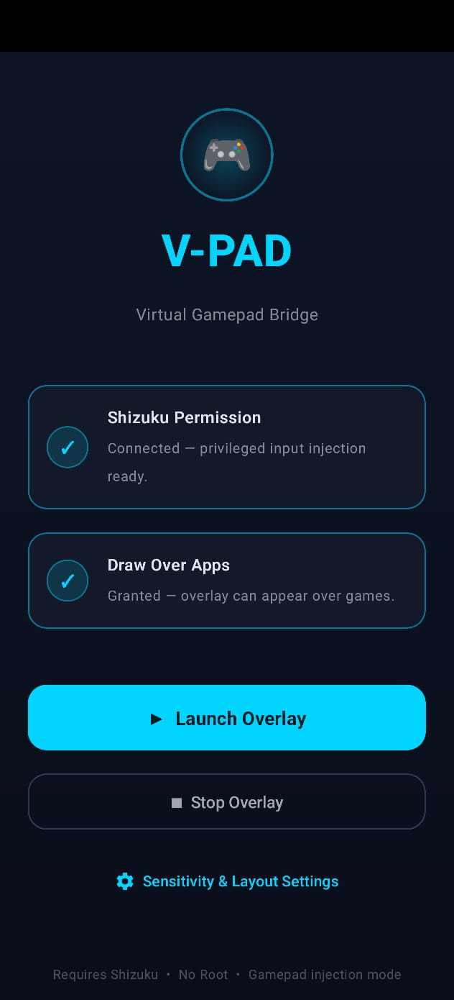
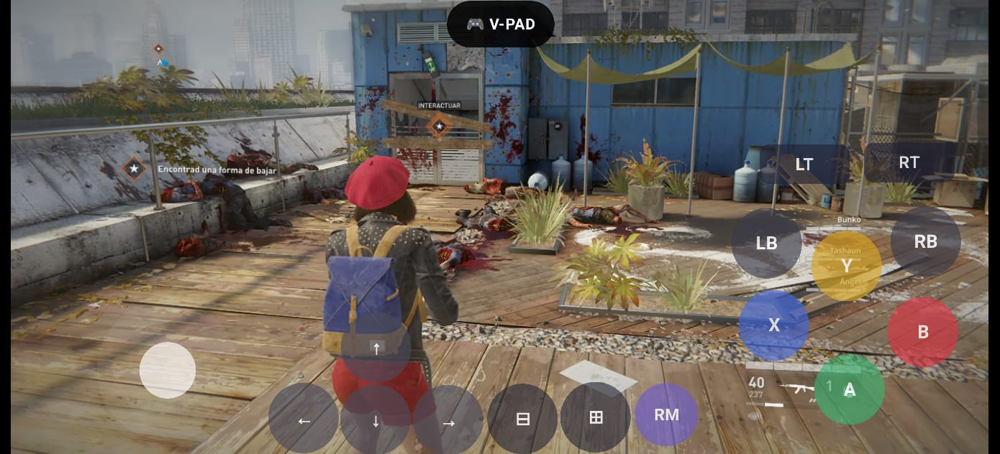
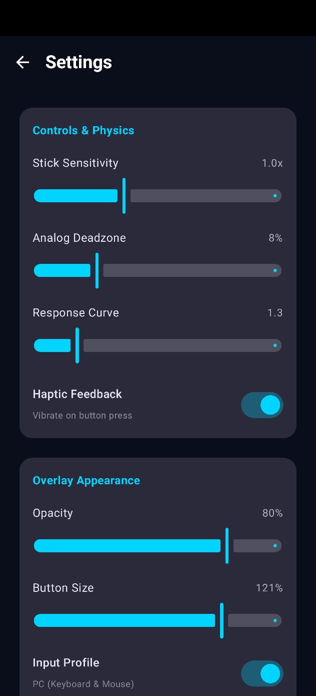
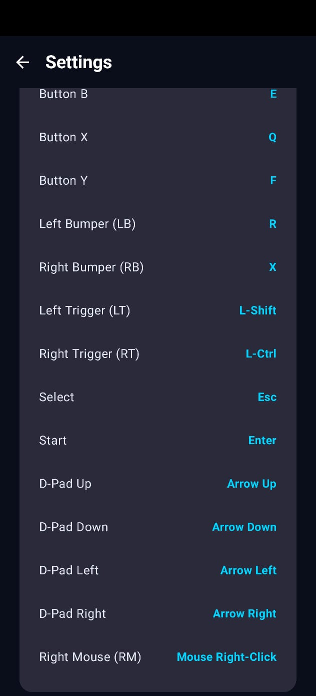
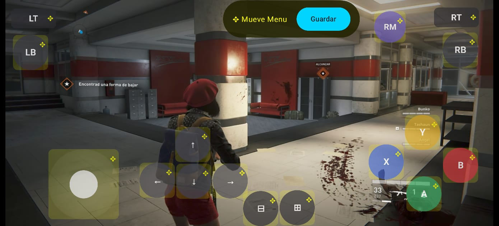
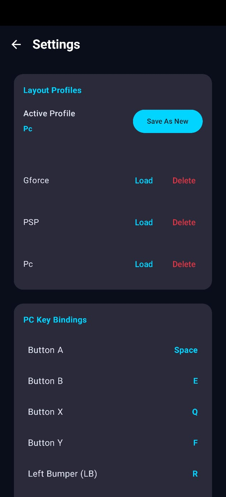

# VirtualX Gaming Overlay

**VirtualX** is an Android overlay that brings PC‑style gamepad controls, gyroscope aiming, and haptic feedback to cloud‑gaming services such as GeForce NOW.

## Features

- Floating control pill with auto‑centering across orientations.
- Full gamepad layout (analog sticks, d‑pad, buttons, triggers).
- Gyroscope‑based mouse look (right stick emulation).
- Haptic feedback on button presses.
- Persistent profile management (multiple control profiles).
- Jetpack Compose UI with smooth animations.

## Screenshots

| Home | In-Game |
| :---: | :---: |
|  |  |

| Settings | Keyboard/gamepad |
| :---: | :---: |
|  |  |

| Edit Controls | Profiles |
| :---: | :---: |
|  |  |

Disclaimer: Games shown in screenshots are for demonstration purposes only and belong to their respective owners.

## Getting Started

1. **Prerequisites**
   - Android Studio Flamingo (or newer).
   - Android device with API 26+.
   - Shizuku installed and granted root/privileged access (required for input injection).

2. **Build the app**
   ```bash
   cd "/VirtualX"
   ./gradlew assembleDebug
   ```
   The APK will be generated in `app/build/outputs/apk/debug`.

3. **Install & run**
   - Transfer the APK to your device and install.
   - Open the app, enable the overlay permission, and toggle the floating pill.
   - Use the Settings screen to enable gyroscope aiming and adjust sensitivity.

## Contribution

Feel free to open issues or submit pull requests. Please follow these steps:

1. Fork the repository.
2. Create a feature branch: `git checkout -b feature/your-feature`.
3. Make your changes, ensuring the code builds.
4. Run `./gradlew lint` and address any warnings.
5. Commit with clear messages and push.
6. Open a PR targeting `master`.

## License

This project is licensed under the MIT License – see the [LICENSE](LICENSE) file for details.
